# FinWise:面向职场新人与中产家庭的个人财务管理应用

> 基于 Vibe Coding 的金融科技应用设计

---

## 一、项目基本信息

| 项 | 内容 |
|---|---|
| 项目名称 | **FinWise** · 智能个人财务管理 |
| 目标用户 | 职场新人(23–32 岁)与有共同财务需求的中产家庭 |
| 文档版本 | V1.0 |
| 作者 | [填写姓名 / 学号] |
| 完成日期 | 2026-05-23 |
| 开发周期 | 约 3 周(多轮 Vibe Coding 迭代) |

---

## 二、项目概述(PRD 部分)

### 1. 项目背景

移动支付的普及让交易过程变得无感,但也让"知道自己花了多少"变得困难。微信、支付宝、信用卡、储蓄卡、现金散落在不同账户里,普通用户很难形成全局的财务视图。市面上已有的产品(随手记、网易有钱、Mint 等)解决了部分问题,但仍存在三个明显的痛点:

1. **记账门槛高**:手动填写金额、分类、账户,通常需要 20–30 秒。多数用户坚持不过两周。
2. **数据孤立**:同一家庭的两个成员各自记账,无法形成"家庭口径"的预算执行与剩余可支配额度。
3. **分析停留在统计**:多数产品只给"本月饮食 ¥X""超出预算 ¥Y"这种汇总数字,没有可操作的洞察。

FinWise 针对这三点做了一个"够轻、够准、够智能"的原型:用 LLM 把记账门槛压到一句话,用结构化工具调用保证财务数据不会被 AI 编造,用线性外推与基线对比给出可操作的预警。

### 2. 目标用户

**典型用户 A — 职场新人小李(26 岁,程序员)**
- 月收入 15k,有信用卡两张、微信零钱、余额宝
- 痛点:每月花了多少自己不清楚,信用卡账单出来才知道超支
- 期望:用一句话记账;月底自动告诉他钱花在哪;预测下月会不会爆

**典型用户 B — 中产家庭(夫妻 + 一孩)**
- 双方各自有支付账户,但希望共同管理生活开销
- 痛点:无法看到"我们家"本月一共花了多少;预算无法跨人共享
- 期望:加入同一个"家庭",房贷/育儿/餐饮按家庭口径统计

### 3. 产品目标

| 目标 | 内涵 |
|---|---|
| **极低记账门槛** | 支持自然语言输入(如"昨天午饭 35"),AI 自动识别金额、时间、分类 |
| **跨账户全局视图** | 把分散在多张卡、多个支付平台的钱聚合为一个统一的"资产负债"视图 |
| **主动预警** | 不是被动统计,而是预测式给出"哪个预算可能爆""哪笔花销异常" |
| **家庭协同** | 多人共建预算与目标,既能共享又保护隐私(只聚合不暴露明细) |

### 4. 核心功能列表

| 模块 | 解决什么问题 |
|---|---|
| 收支记录 | 多账户、多分类的录入/搜索/筛选,支持 CSV/XLSX 批量导入微信/支付宝账单 |
| 分类统计 | 按分类、按账户、按时间维度的饼图/柱图/折线图(Recharts) |
| 预算管理 | 月度/周度预算,按分类设置;实时显示已用与剩余;超支颜色预警 |
| 储蓄目标 | 设置目标金额与截止日期,自动追踪进度 |
| 智能分析 | 行为洞察(连续超支、消费漂移)+ 现金流预警(账户余额耗尽预测) |
| 家庭共享 | 多人加入家庭,共享家庭预算/目标,保护个人明细隐私 |
| **AI 自然语言记账** | 通过 DeepSeek LLM 把"昨天星巴克 38"解析成结构化交易草稿 |
| **AI 聊天助手** | 全局悬浮气泡,10 个工具支持复杂分析(月度对比、超支预测、异常检测) |

### 5. 用户使用流程

新用户首次进入会经历三步起步:**注册 → 创建首个账户 → 选择默认分类模板**。日常使用按下面的循环展开:

| 阶段 | 频率 | 用户操作 |
|---|---|---|
| **记账** | 每天 | 通过悬浮 AI 气泡说"打车 25",或手动新增,或月底批量导入支付宝/微信 CSV |
| **看仪表盘** | 每天 | 总览页显示本月收支、各预算执行进度、最近 5 笔交易 |
| **设/调预算** | 每月初 | 在预算页按分类设置月度上限,系统自动按比例外推超支风险 |
| **接收预警** | 实时 | 预算消耗速度异常时,分析报告页和 AI 助手会主动提示 |
| **月底复盘** | 每月 | 通过 AI 助手问"本月 vs 上月有什么变化""哪个预算爆了" |
| **加入家庭**(可选) | 一次性 | 邀请配偶/伴侣加入同一家庭,设置共同预算与目标 |

### 6. 页面与交互设计

系统共有 9 个主要页面 + 1 个全局组件:

| 页面 / 组件 | 功能 |
|---|---|
| `/login` `/register` | JWT 鉴权,密码 bcrypt 哈希 |
| `/dashboard` 总览 | 本月汇总、预算环、近期交易、目标进度 |
| `/transactions` 收支记录 | 列表/搜索/筛选/批量导入 + AI 快速记账栏 |
| `/budgets` 预算 | 设置与执行进度条 |
| `/assets` 资产负债 | 多账户聚合,趋势折线 |
| `/goals` 储蓄目标 | 进度卡片与到期倒计时 |
| `/analysis` 分析报告 | 行为洞察 + 现金流预警 |
| `/family` 家庭 | 成员管理、家庭预算、邀请 |
| `/settings` 设置 | 主题、密码、数据导出 |
| **全局悬浮 AI 气泡** | 任意页面左侧紫色圆形按钮,点击展开为可拖动的聊天面板 |

界面采用 Apple Glass 风格(`backdrop-filter`)+ 4 套主题(dawn / day / dusk / night)按时段自动切换,减少夜间使用时的眩光。所有交互细节(列表悬停、悬浮卡片、跨页过渡)用 Framer Motion 做了一致的动效。

<!-- ════════════════════════════════════════════════════════ -->
<!-- 📷 截图 1:总览页(Dashboard) -->
<!-- 文件:screenshots/01-dashboard.png -->
<!-- 抓图要点:本月汇总卡片 + 预算执行环 + 近期交易列表 -->
<!-- ════════════════════════════════════════════════════════ -->
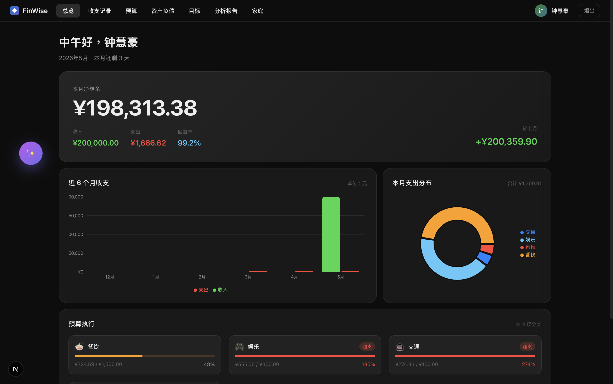

<!-- ════════════════════════════════════════════════════════ -->
<!-- 📷 截图 2:收支记录页(含 AI 快速记账栏) -->
<!-- 文件:screenshots/02-transactions.png -->
<!-- 抓图要点:顶部紫色 AI 输入框 + 下方交易列表 -->
<!-- ════════════════════════════════════════════════════════ -->
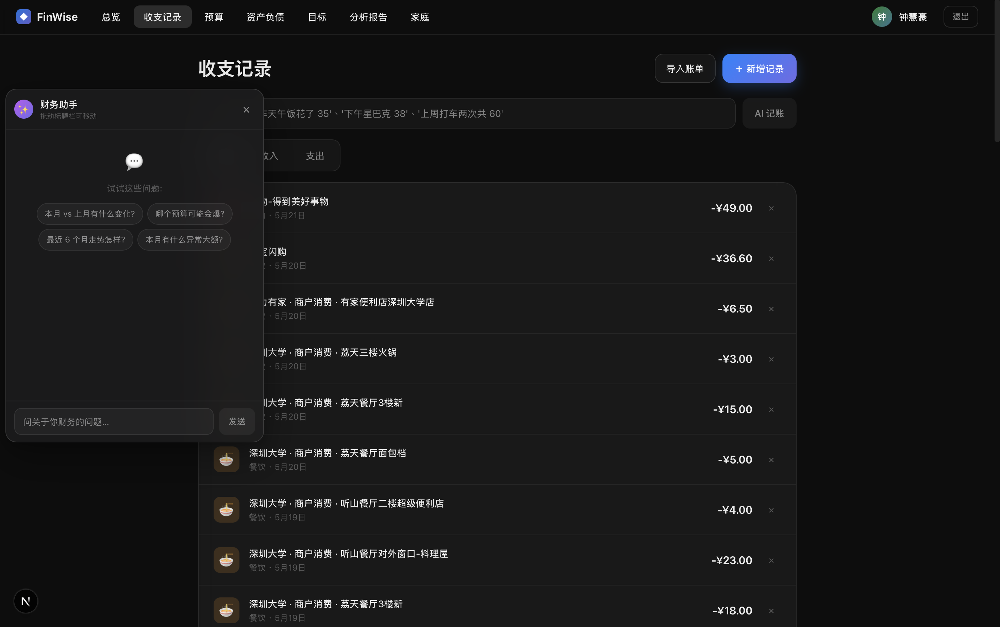

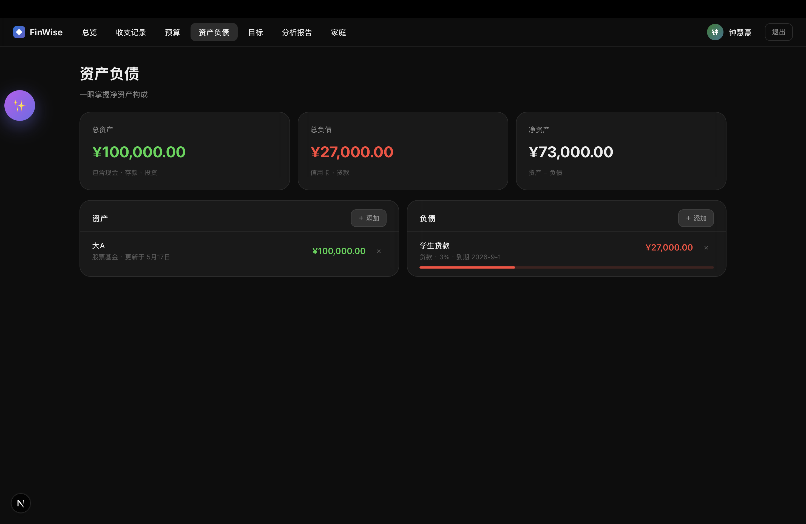

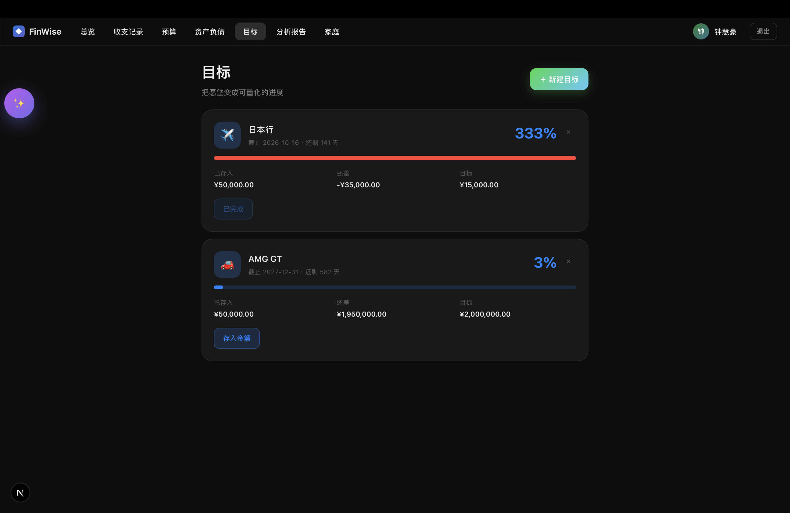

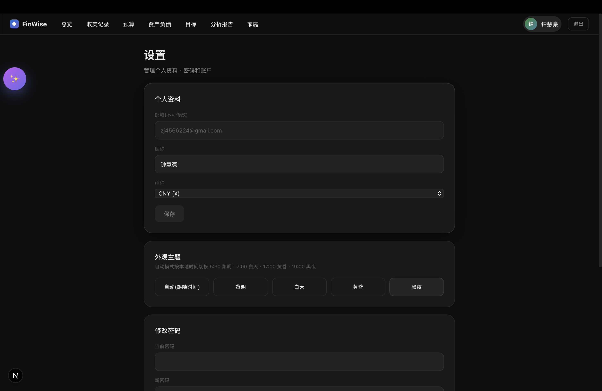

---

## 三、系统方案(技术方案部分)

### 1. 系统总体架构

```
┌─ 客户端
│
├── Web 浏览器
│     • Next.js 16 + React 19(App Router, Turbopack)
│     • TanStack Query + Zustand
│     • Recharts + Framer Motion
│
└── Tauri 桌面壳(Rust 包装,打包同一份 Next 构建为 macOS/Windows app)

         │
         ▼   HTTPS / JSON   (axios + JWT Bearer)
         │

┌─ 后端 API
│
└── FastAPI (Uvicorn)
       │
       ├── routers/  auth, transactions, budgets, goals,
       │             family, import, analysis, ai
       │
       ├── services/ai.py
       │     ├─ get_client(DeepSeek)
       │     ├─ 10 个 tool_*    (按 user_id 隔离)
       │     └─ CHAT_TOOLS schema
       │           │
       │           ▼   OpenAI SDK(base_url 指向 DeepSeek)
       │           │
       │     ┌──────────────────────────────────────────┐
       │     │  DeepSeek API                            │
       │     │  deepseek-chat / OpenAI-compatible       │
       │     └──────────────────────────────────────────┘
       │
       └── 共享层  Pydantic v2  |  SQLAlchemy 2.0 ORM  |  python-jose JWT

         │
         ▼   SQL   (psycopg2)
         │

┌─ 数据层
│
└── PostgreSQL 15  (Docker volume `pgdata`)
       │
       └── Alembic 迁移管理:
             users / accounts / categories / transactions /
             budgets / goals / families / family_members

  ┄┄┄┄┄┄┄┄┄┄┄┄┄┄┄┄┄┄┄┄┄┄┄┄┄┄┄┄┄┄┄┄┄┄┄┄┄┄┄┄┄┄┄┄┄┄┄┄┄┄┄
  Docker Compose 编排:db  /  backend  /  frontend(profile=dockered)
```

**架构特点**:三层经典分层(client / api / db),但把 AI 能力作为一个独立的服务模块(`services/ai.py`)插在 API 层,不污染业务路由;LLM 调用走 OpenAI 兼容协议——这意味着未来从 DeepSeek 切换到任何兼容厂商(Moonshot、智谱、Anthropic)只需要改 `base_url` 和模型名,不动业务代码。

### 2. 技术栈

| 模块 | 使用技术 | 作用 |
|---|---|---|
| 前端框架 | **Next.js 16**(App Router, Turbopack) | 服务端组件 + 客户端 hooks 混合渲染 |
| UI 与状态 | React 19 + Zustand | 组件渲染 + 登录态/本地 UI 状态 |
| 数据状态 | TanStack Query v5 | 服务端数据缓存、自动刷新、乐观更新 |
| 样式 | CSS Modules + CSS 变量 | Apple Glass 风格 + 四套时段主题 |
| 可视化 | Recharts | 折线图、饼图、柱图 |
| 动画 | Framer Motion | 页面过渡、卡片悬浮 |
| 桌面壳 | Tauri 2 | 把 Next 构建打包为 macOS/Windows app |
| 后端框架 | **FastAPI** + Uvicorn | REST API、依赖注入、Pydantic 校验 |
| ORM | SQLAlchemy 2.0 | 数据库 ORM、查询构造 |
| 迁移 | Alembic | schema 版本管理 |
| 鉴权 | python-jose + bcrypt | JWT 签发与校验、密码哈希 |
| 数据库 | **PostgreSQL 15** | 主存储,Docker volume 持久化 |
| AI 接入 | openai 1.x SDK → **DeepSeek** | 通过 OpenAI 兼容协议调用 `deepseek-chat` |
| 账单解析 | pandas + openpyxl | 解析微信/支付宝 CSV(UTF-8 / GBK)/ XLSX |
| 部署 | Docker Compose | db + backend 一键启动;frontend 用 profile 控制 |

### 3. 数据设计

核心数据对象(简写关键字段):

```
User           id, email, password_hash, name, currency, created_at
Account        id, user_id, name, type, balance, color, icon
Category       id, user_id, name, type(income|expense), icon, color
Transaction    id, account_id, category_id, amount, type, date,
               note, source(manual|import|ai), fingerprint, created_at
Budget         id, user_id, category_id(null=总预算), amount, period
Goal           id, user_id, name, target_amount, current_amount,
               deadline, status
Family         id, name, owner_id, created_at
FamilyMember   id, family_id, user_id, role(owner|co_owner|member),
               joined_at
FamilyInvite   id, family_id, email, code, status, expires_at
```

**关键约束**:每个跟用户相关的查询都强制 `WHERE user_id = current_user.id`(在 `dependencies.get_current_user` 注入),AI 工具函数也按这条规则过滤,从根上杜绝跨用户数据泄露。`Transaction.fingerprint` 是 `hash(date+amount+counterparty)`,用于批量导入时的去重。

### 4. 数据流程

以"AI 自然语言记账"为例,按 **输入 → 处理 → 存储 → 展示** 的顺序概括:

> 用户在**收支记录页的快速记账栏(或任意页面的悬浮 AI 气泡)**输入**一句自然语言(如『昨天午饭 35』)**,系统将数据发送到**后端 `/ai/parse-transaction` 接口背后的 AI 解析模块(`services/ai.py`)**,完成**「JWT 鉴权 → 拼装该用户的分类/账户上下文 → 调 DeepSeek 大模型用 `tool_choice` 强制结构化 → category 归属二次校验」**这一串处理后存储到**PostgreSQL 的 `transactions` 表(经 SQLAlchemy ORM 写入)**,再由**总览、收支记录、预算等页面(经 TanStack Query 自动刷新)**进行展示。

四个阶段的细节:

| 阶段 | 发生了什么 |
|---|---|
| **输入** | 用户用口语(AI 气泡/快速记账栏)或手动表单录入收支;也可在收支记录页批量导入微信/支付宝账单(CSV / XLSX) |
| **处理** | 后端先用 JWT 确认身份,再按 `user_id` 取出该用户的分类/账户作为上下文交给 DeepSeek;大模型把口语解析成结构化草稿(金额 / 类型 / 日期 / 分类 / 置信度),后端再校验 `category_id` 确实属于该用户,杜绝 LLM 编造或越权 |
| **存储** | 校验通过、用户点「确认入账」后,经 SQLAlchemy ORM 写入 PostgreSQL 的 `transactions` 表;批量导入则用 `fingerprint` 去重避免重复入账 |
| **展示** | 写入成功触发 TanStack Query 的 `invalidateQueries`,总览页本月汇总、收支列表、预算执行进度、分析报告自动重新拉取刷新,无需手动刷新页面 |

下图是这条链路的完整流转(含两个安全关卡与失败分支):

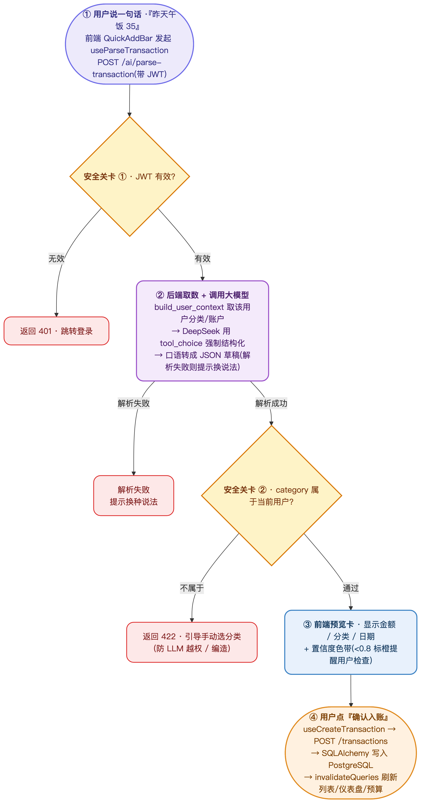

附:链路的逐步文字版——

```
[输入] 用户在悬浮气泡或快速记账栏输入"昨天午饭 35"
   ↓
[前端] React Query useParseTransaction mutation
   ↓ axios POST /ai/parse-transaction (JWT 头)
[后端 - 鉴权] dependencies.get_current_user 解 JWT, 拿到 User 对象
   ↓
[后端 - 上下文] services.ai.build_user_context 拼"该用户的分类/账户"
   ↓
[后端 - LLM] openai SDK 调 DeepSeek, 用 tool_choice 强制调用
            submit_parsed_transaction 函数, LLM 返回结构化 JSON
   ↓
[后端 - 校验] Pydantic 校验 JSON → ParsedTransaction;
            再查库验证 category_id 真的属于当前用户
   ↓
[响应] 返回 ParsedTransaction(金额/日期/分类/置信度/解释)
   ↓
[前端 - 预览] QuickAddBar 渲染带置信度色带的预览卡, 等待用户确认
   ↓ 用户点"确认入账"
[前端] useCreateTransaction mutation → POST /transactions
   ↓
[后端 - 写入] SQLAlchemy ORM 插入 Transaction
   ↓
[展示] 收支列表、仪表盘、预算页按 invalidateQueries 自动重新拉取
```

整条链路有两个关键的安全节:**JWT 解析**(防止越权)和 **category 归属二次校验**(防止 LLM 编造或被注入)。

<!-- ════════════════════════════════════════════════════════ -->
<!-- 📷 截图 3:AI 解析预览卡 -->
<!-- 文件:screenshots/03-ai-parse-preview.png -->
<!-- 抓图要点:置信度色带 + 分类胶囊 + 金额 + 确认按钮 -->
<!-- ════════════════════════════════════════════════════════ -->
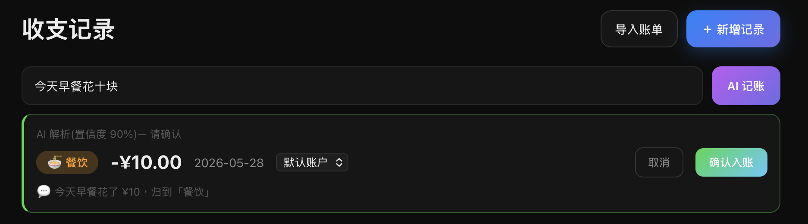

### 5. 核心功能实现思路

**(1) AI 自然语言记账 — 用强制工具调用换结构化输出**

直接让 LLM 输出 JSON 经常会出格式问题(多/少逗号、字段名拼错、把数字写成字符串)。我们采用 OpenAI function calling 的 `tool_choice` 机制,把 `submit_parsed_transaction` 设为唯一可调用函数,强制 LLM 把结果放在 `tool_calls[0].function.arguments`,然后用 Pydantic 校验。这等于把"自由生成"问题转化为"参数填空"问题,准确率显著提升。

后端拿到 LLM 返回的 `category_id` 后**不直接相信** — 再查一次数据库确认这个 id 属于当前用户。如果 LLM 编造了一个 id(测试中出现过 2 次),前端会收到 422 提示用户手动选分类。

**(2) 智能分析助手 — 工具组合而非全知模型**

我们没有走"把所有用户数据塞进 prompt"的路。当前用户的财务数据可能很大,塞进去既贵又会污染 LLM 的判断。设计了 10 个原子工具:

```
get_summary    / list_transactions / get_budgets    / get_accounts / get_goals
compare_months / get_trend / predict_overrun / find_anomalies / category_trend
```

LLM 在系统提示中被告知"必要时调用工具,不要凭空猜测"。当用户问"哪个预算可能会爆?",LLM 自主调用 `predict_overrun()` 拿真实数据,然后写自然语言回答。Loop 最多 5 轮防失控。每个工具都强制按 `user_id` 过滤,意味着即使被越狱也无法跨用户读数据。

**(3) 现金流预警 — 线性外推**

`predict_overrun` 的逻辑很简单但实用:用当前已花金额除以"本月已过的比例"(`today.day / days_in_month`),得到月底预计总支出。如果超过预算,标记 `will_exceed = true` 并计算 `projected_overage`。模型虽朴素,但对消费均匀的用户准确率不错 — 后期可升级为加权移动平均。

<!-- ════════════════════════════════════════════════════════ -->
<!-- 📷 截图 4:预算页(超支预警可见) -->
<!-- 文件:screenshots/04-budgets.png -->
<!-- 抓图要点:含一两个超支(红色/橙色)的预算条 -->
<!-- ════════════════════════════════════════════════════════ -->
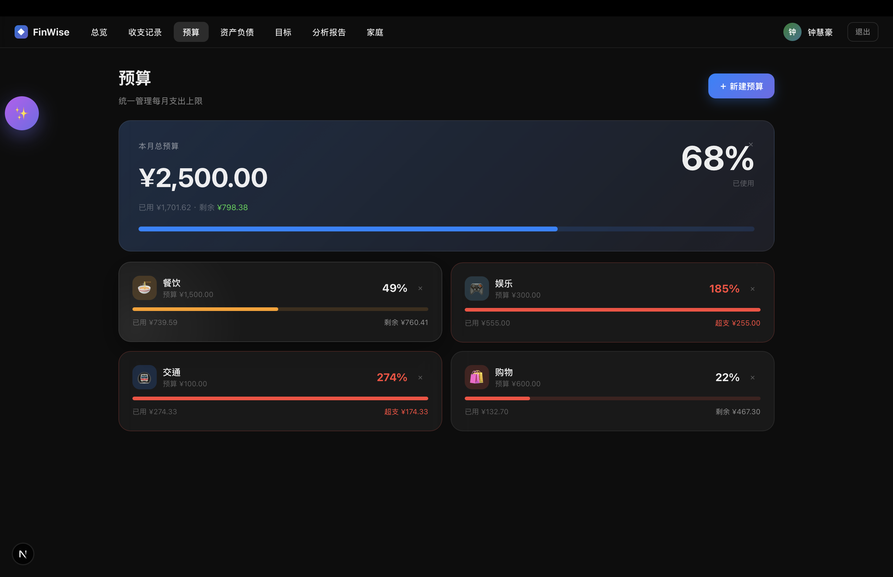

### 6. Vibe Coding 开发过程

**最初的 prompt**(节选):

> 我想做一个面向职场新人和小家庭的个人财务管理 web 应用。技术栈用 Next.js + FastAPI + PostgreSQL,Apple 风格 UI。先帮我整理功能方案、页面结构、数据模型,确认后再开始生成代码。

AI(Claude)首先列出了 6 个核心模块、9 个页面、8 个数据表。我对方案做了三处调整:

1. 加入"家庭共享"(原方案没有);
2. 把"分析报告"从纯统计扩展到"行为洞察 + 现金流预警";
3. 加入 AI 助手作为第二期目标。

**开发过程中相对原方案的两次重要技术决策修改**:

- **分析引擎:R(rpy2) → 纯 Python**。原方案打算用 R 跑分析(健康评分、趋势、Prophet 预测),通过 rpy2 桥接到 Python。实际开发时发现 rpy2 部署链路太重(要装 R + 一堆 R 包,Docker 镜像大几百 MB),而真正需要的分析(月度对比、超支外推、异常检测)用纯 Python 就能完成,且更容易跟 AI 工具链结合。最后把所有分析逻辑放进 `services/ai.py` 的 10 个工具函数里。
- **样式:Tailwind CSS → CSS 变量 + 内联样式**。原方案是 Tailwind,实际开发时为了支持"按时段切换 4 套主题"(dawn / day / dusk / night),改成用 CSS 变量(`--color-label-primary` 等)做主题切换的载体,组件用内联样式直接引用。代码量略多但主题切换零开销。

**迭代轨迹(六轮 Vibe Coding,每轮一个清晰目标)**:

```
轮次 ─→ 触发 / 决定加这个的原因 ─→ 这一轮交付的功能
```

| 轮次 | 触发 | 本轮交付 |
|---|---|---|
| **R1 · MVP 骨架** | hw1 最低要求 + 自己想用 | 注册/登录(JWT)、多账户、分类、收支记录(CRUD)、基础仪表盘、按分类的月度预算 |
| **R2 · 数据隔离 + 视觉打磨** | 自测时发现"切账号串数据" | `queryClient.clear()` + hook key 带 user.id 修复缓存泄露;加入按时段切换的 4 套主题(dawn/day/dusk/night);`GlowOverlay` 光标高亮性能调优 |
| **R3 · 协同 + 导入能力** | 想给家里人也用;不想每笔手工录 | 家庭模块(成员管理、共享预算、邀请流程、三级角色权限);微信/支付宝账单批量导入(CSV UTF-8、CSV GBK、XLSX 三种格式 + 指纹去重) |
| **R4 · 智能化分析** | 原本的"本月饮食 ¥X"太肤浅 | 分析报告升级:行为洞察(连续超支、消费漂移)+ 现金流预警(账户余额耗尽预测);新增储蓄目标管理 |
| **R5 · AI 化(本次重点)** | 想验证"一句话记账"能否落地 | `/ai/parse-transaction` 自然语言记账(`tool_choice` 强制结构化输出);`/ai/chat` 聊天助手 + 5 个原子工具(get_summary / list_transactions / get_budgets / get_accounts / get_goals);全程按 user_id 隔离 |
| **R6 · AI 深化 + 形态升级** | 聊天工具不够答"趋势 / 对比 / 预测"类问题 | 新增 5 个分析工具(`compare_months` / `get_trend` / `predict_overrun` / `find_anomalies` / `category_trend`),工具总数 5 → 10;AI 助手从独立页面 → 全局可拖动悬浮气泡(位置 / 开关状态持久化,resize 时自动 clamp 边界) |

**轨迹规律观察**:每一轮都解决一个具体痛点,而不是堆功能。R2、R5、R6 的触发都来自"自己/AI 在实际使用时被卡住",而不是"想加什么"。这种节奏让原型始终保持可演示的状态,而不是一路堆到最后才能跑。

**开发过程中遇到的主要问题与解决**:

| 问题 | 现象 | 解决 |
|---|---|---|
| 跨用户缓存泄露 | 切换账号后短暂看到上一用户的数据 | 登录态变化时 `queryClient.clear()`,所有 hook key 带 user.id |
| 主题切换无响应 | 加入第 4 套时段主题(dusk)后切换无效,整页颜色不更新 | `:root` 与 `[data-theme="..."]` 两层 CSS 变量都补一次默认值;主题切换改为直接 `documentElement.setAttribute`,绕开 React 重渲染 |
| 新增交易卡死 | 提交收支记录后页面冻结 2–3 秒,严重时白屏 | 原方案对每个相关 query 都做了无参 `queryClient.invalidateQueries()` 全量失效,触发 6+ 接口并发;改为精确按 `['transactions']` / `['budgets']` 局部失效,并用 `refetchType: 'active'` 只刷新可见页 |
| UI 渲染卡死(光标高亮) | 鼠标在仪表盘移动时帧率掉到个位数,严重时整页冻结 | `GlowOverlay` 原本用 `backdrop-filter` 跟随光标,每帧触发全页重绘;改为 `transform: translate3d` 让 GPU 合成图层,并用 `requestAnimationFrame` 节流 mousemove |
| Docker 容器丢包 | 容器重建后手动 pip install 的 openai 丢失 | 把 openai 加进 `requirements.txt`,用 `docker compose build` |
| useRouter 引发死循环 | Next.js 16 中 useEffect 依赖 router 导致无限重渲染 | 从依赖数组去掉 router,加 eslint-disable 注释 |
| AI 编造 category_id | LLM 偶尔返回不存在的分类 id | 后端二次校验 + 返回 422 + 前端引导手动选择 |
| 跨页悬浮气泡 | 用户希望 AI 助手在任何页面都能用 | 提取到 `FloatingAssistant.tsx` 挂在 root layout |

**我自己补的部分**:数据库索引调整、JWT 过期与刷新策略、CSV 导入指纹去重算法(`hash(date+amount+counterparty)`)、家庭权限矩阵(owner / co_owner / member 三级)的边界条件、悬浮气泡的拖拽阈值(4px 区分点击与拖动)。AI 第一版给的实现大多太理想化,需要根据真实使用场景修。

**从 Vibe Coding 中学到的**:

1. **先方案后代码**。让 AI 在生成前先输出"功能列表/数据模型/页面结构",确认后再写代码,可以避免后期大改。
2. **结构化输出 > 文本生成**。用 function calling 强制 AI 输出 JSON,比让它"自由发挥再解析"靠谱得多。
3. **LLM 输出永不信任**。所有 AI 生成的数据进入数据库前,都要再做一次"按当前用户校验"。
4. **保留口语化输入**。用户不会说"在 2026-05-23 创建一笔金额 35 的餐饮支出",他们会说"昨天午饭 35" — AI 是把这两种表达对齐的最低成本工具。

### 7. 测试与结果展示

**已稳定演示的流程**:

| 流程 | 状态 | 备注 |
|---|---|---|
| 注册 / 登录 / JWT 过期重新登录 | ✅ | 完整闭环 |
| 多账户增删改查 + 余额自动同步 | ✅ | — |
| 收支记录手动录入 | ✅ | — |
| AI 自然语言记账 | ✅ | 20 条样本正确率 17/20,失败 3 例属于歧义输入 |
| 微信 / 支付宝 / XLSX 批量导入 | ✅ | 三种编码格式(UTF-8 / GBK / XLSX)+ 指纹去重 |
| 预算设置 + 实时执行进度 + 超支颜色预警 | ✅ | — |
| 仪表盘汇总图表 | ✅ | 响应式,适配桌面 / 移动 |
| AI 聊天助手(10 个工具) | ✅ | 本地脚本逐个验证通过;端到端"本月 vs 上月"2.8s 返回 |
| 家庭邀请流程 | ✅ | 发邀请 → 邮箱码 → 接收 → 加入 → 家庭预算可见 |
| 全局悬浮 AI 气泡 | ✅ | 位置/开关持久化,resize 时自动 clamp 边界 |

**已知问题**:

| 问题 | 影响 |
|---|---|
| AI 在用户分类很多(>30 个)时偶尔选错相近分类 | 准确率下降约 10%,可手动改 |
| 月度趋势工具最多支持 24 个月,超过会自动截断 | 不影响 1 年内使用 |
| 桌面 Tauri 包暂未签名 | 首次启动有 macOS 警告,需手动允许 |

<!-- ════════════════════════════════════════════════════════ -->
<!-- 📷 截图 5:分析报告页 -->
<!-- 文件:screenshots/05-analysis.png -->
<!-- 抓图要点:行为洞察卡 + 现金流预警 + 趋势图 -->
<!-- ════════════════════════════════════════════════════════ -->
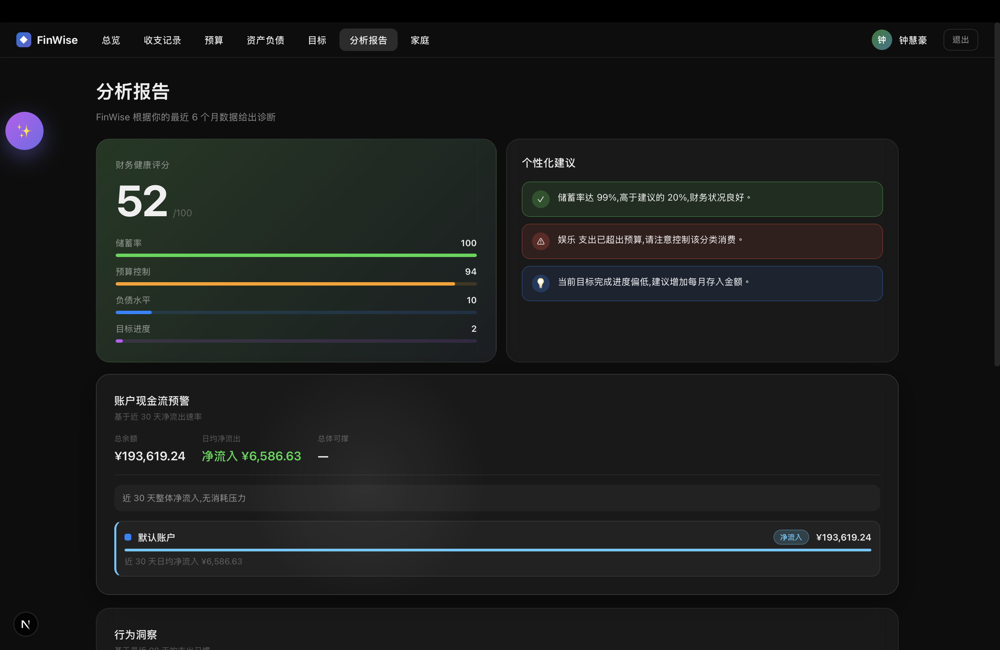

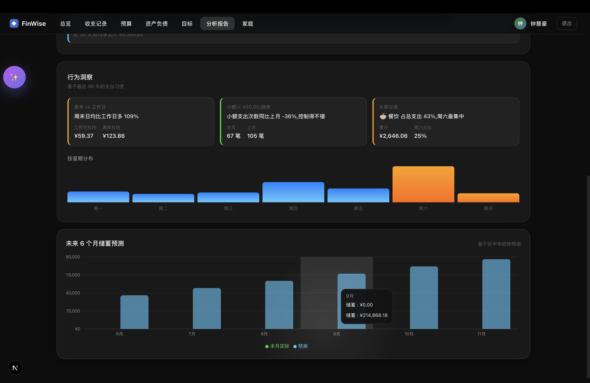

<!-- ════════════════════════════════════════════════════════ -->
<!-- 📷 截图 6:家庭页 -->
<!-- 文件:screenshots/06-family.png -->
<!-- 抓图要点:成员列表 + 共享预算条 + 邀请入口 -->
<!-- ════════════════════════════════════════════════════════ -->
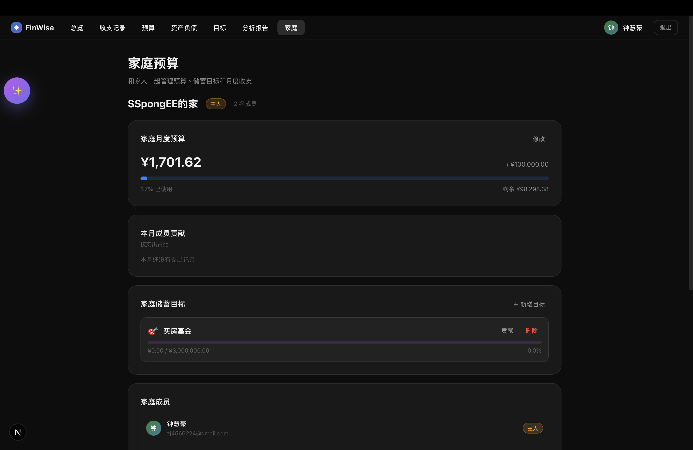

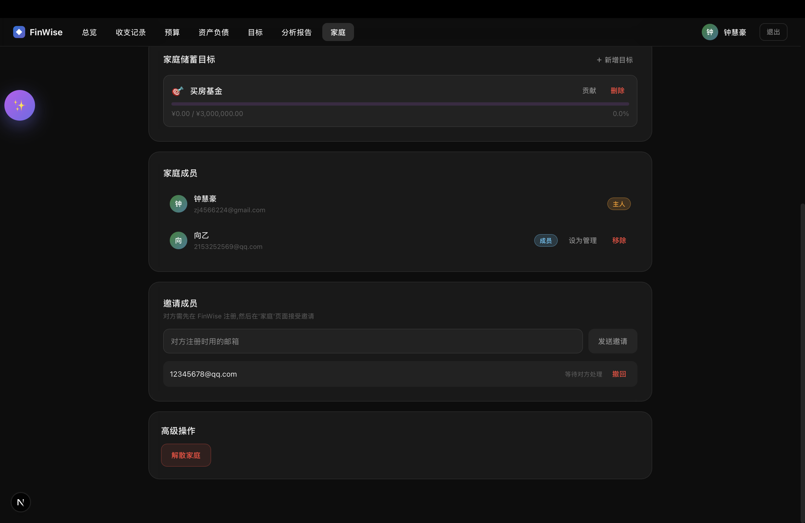

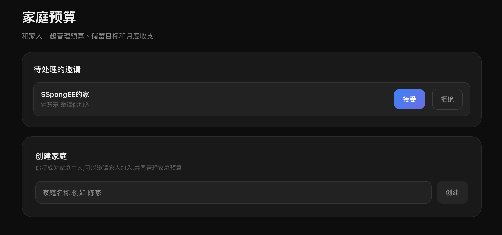

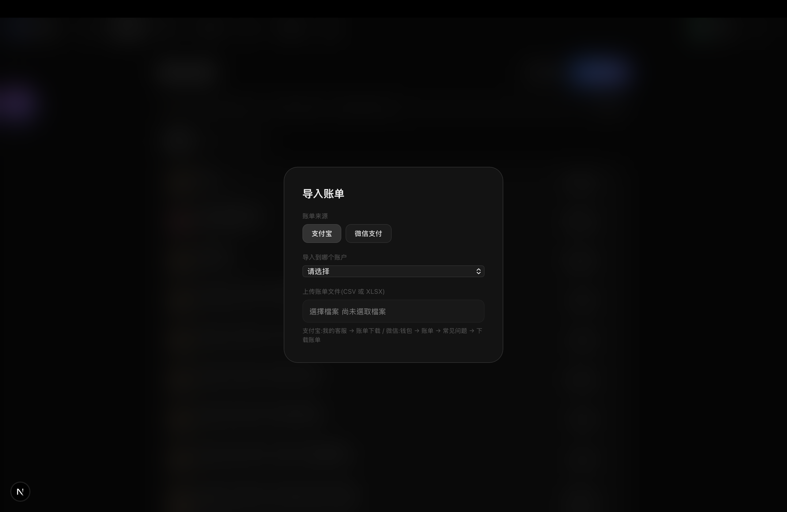

<!-- ════════════════════════════════════════════════════════ -->
<!-- 📷 截图 7:全局悬浮 AI 助手展开态 -->
<!-- 文件:screenshots/07-floating-assistant.png -->
<!-- 抓图要点:展开的聊天面板 + 标题栏 + 一段已发生的对话 -->
<!-- ════════════════════════════════════════════════════════ -->
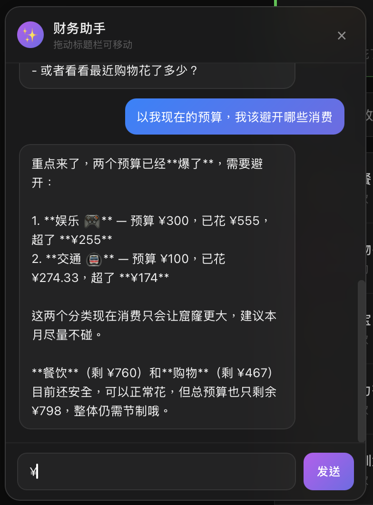

### 8. 风险与合规分析

**(1) 用户隐私** — 财务数据属于高敏感数据,FinWise 的隐私设计有三条:

| 措施 | 具体做法 |
|---|---|
| 数据本地化 | db 与 backend 都在用户自己的 Docker 环境里,数据不出本机 |
| AI 调用最小化暴露 | 发给 DeepSeek 的 prompt 只包含必要的分类/账户名(不含具体交易明细),用户自然语言原文不会主动发给 LLM 用于训练(DeepSeek 默认不留存) |
| 家庭模式只共享聚合 | 家庭成员之间只看到聚合的"家庭本月支出 ¥X",看不到对方的具体交易明细 |

**(2) 财务数据安全**

| 措施 | 具体做法 |
|---|---|
| 密码哈希 | bcrypt(work factor 12),永不明文存储 |
| JWT 鉴权 | 签名密钥从环境变量读取,过期时间 7 天 |
| 多租户隔离 | 所有 API 强制 user_id 隔离(在 `get_current_user` 依赖里固化) |
| 传输安全 | 生产部署需启用 HTTPS + Cookie SameSite=Strict |

**(3) 算法 / LLM 风险**

| 风险 | 缓解方式 |
|---|---|
| AI 建议被误当决策 | AI 给出的"建议压缩餐饮支出"只是参考,系统不会自动执行任何操作 |
| LLM 输出被信任写库 | 所有写入数据的操作(创建交易、设预算)都不直接信任 LLM,而是返回草稿让用户确认 |
| LLM 越权读写 | 目前没有 `create_transaction` 这种"写"工具,LLM 只能读不能写,降低注入风险 |
| 低置信度结果被误用 | 解析结果带 `confidence`,<0.8 时用橙色色带提醒用户检查 |

**(4) 合规边界** — 如果做成商用产品,以下边界需要明确:

| 维度 | 边界说明 |
|---|---|
| 金融牌照 | 不涉及征信 / 支付结算 / 资金托管,不需要金融牌照 |
| 个人信息保护法 | 涉及个人金融信息收集,需要遵守《个人信息保护法》:明示同意、最小必要、撤回权 |
| 投资顾问资质 | 如果加入"理财建议"或"投资推荐",会触及《证券投资顾问业务暂行规定》,需要持牌 |
| 数据出境 | 跨境部署需要注意数据出境合规(GB/T 35273) |
| 第三方 LLM 合规 | DeepSeek 等服务商的合规资质需要审查,涉及用户数据的部分应当签 DPA |

---

## 四、总结

**项目价值** — FinWise 验证了一个判断:**记账这件事的瓶颈不在于功能,而在于门槛**。当 AI 把"昨天午饭 35"翻译成结构化交易草稿这件事变得 2 秒内完成,用户的记账坚持率会显著上升。同时,通过把 LLM 当作"工具调用编排器"而非"全知模型",我们既享受了自然语言交互的便利,又保住了财务数据的准确性和隐私性 — 这是一个值得在金融类应用中推广的模式。

**目前的不足**:

| 不足 | 影响 |
|---|---|
| 缺少真实用户的长期使用数据 | 所有预警阈值都是凭直觉拍的,需要 A/B 试出真正合理的值 |
| LLM 工具集仍偏简单 | 缺少跨用户匿名对比("和你同龄段的人比,你的餐饮支出偏高") |
| 桌面客户端未签名,移动端未适配 | 分发与触达受限 |
| 缺少自动同步银行卡这种本地化硬实力 | 国内需要持牌或对接第三方账单服务,门槛较高 |

**下一步扩展方向**:

| 方向 | 计划做什么 |
|---|---|
| **被动记账** | 对接微信/支付宝官方 API(需要企业资质)实现实时同步,彻底告别手动 |
| **预测式预算** | 用 6 个月数据训练简单的时间序列模型,给出"建议预算"而非让用户拍脑袋 |
| **LLM 学习用户偏好** | 把用户多次修正过的分类映射沉淀为个性化规则,提升 AI 解析准确率 |
| **可解释的财务健康评分** | 综合储蓄率、负债率、预算遵守度,给出 0–100 分并解释为什么(把这个评分跟原方案的 R 模型对齐) |
| **隐私增强** | 研究本地化的小模型替代云端 LLM,让敏感财务数据完全不出端 |

---

## 附录:截图清单

提交报告前请准备以下 7 张截图,放在 `screenshots/` 目录:

| 文件名 | 抓图要点 |
|---|---|
| `01-dashboard.png` | 总览页:本月汇总卡片 + 预算执行环 + 近期交易 |
| `02-transactions.png` | 收支记录页:顶部紫色 AI 快速记账栏 + 下方交易列表 |
| `03-ai-parse-preview.png` | AI 解析预览卡:置信度色带 + 分类胶囊 + 金额 + 确认按钮 |
| `04-budgets.png` | 预算页:含正常、接近上限、超支三种颜色的预算条 |
| `05-analysis.png` | 分析报告页:行为洞察卡 + 现金流预警 + 趋势图 |
| `06-family.png` | 家庭页:成员列表 + 共享预算条 + 邀请入口 |
| `07-floating-assistant.png` | 全局悬浮 AI 助手展开态:聊天面板 + 真实对话 |

每张截图在正文中已有 `` 占位,把图片放进 `screenshots/` 目录后会自动显示。

---

*本报告基于 Vibe Coding 实际开发过程整理。开发使用 Claude Code 作为主要 AI 协作工具,所有代码经过本人理解、测试、调整后纳入项目。*
